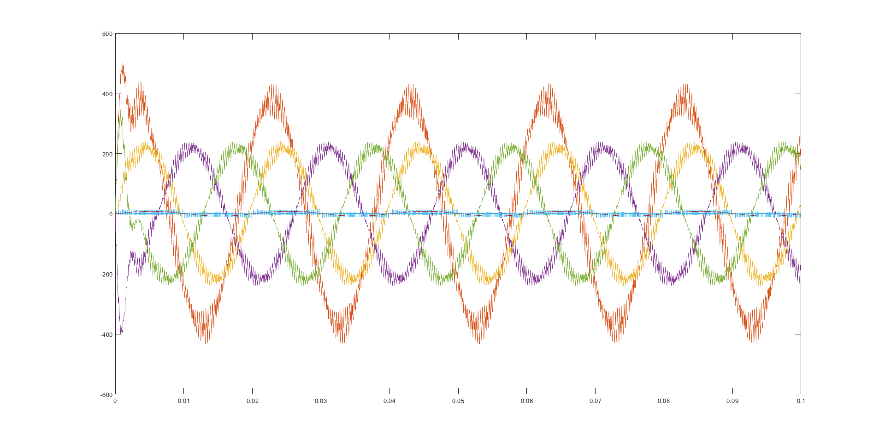
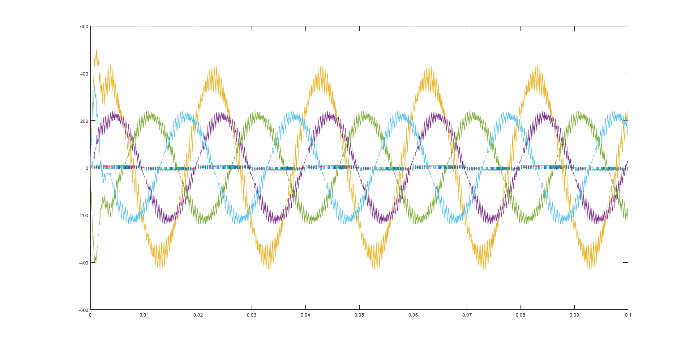

# go-decim

Decimate xy data using `Sampler` type.

```go
    // xyer implements the plot.XYer interface from gonum/plot.
    xyer := newXYer()
	s := NewSampler(xyer, 1)
    // Accumulate downsampled values.
	var xs, ys []float64
	var x, y float64
    // Ends on io.EOF receive or if NaN/inf value encountered
	for ; err == nil; x, y, err = s.Next() {
		xs = append(xs, x)
		ys = append(ys, y)
	}
```


## Decimate - CSV processing

Need to graph a curve obtained through a simulation and the amount of points makes pgfplots run out of memory? Or do you simply want to reduce the size of your vector graphics?
---
Decimate will reduce the amount of points on your curve drastically while maintaining visual fidelity.

### Decimate is run from command line
run `decimate -h` for help

## Example


Above is graphed data from a 134MB file (8.4 million data entries). Following image is downsampled data using decimate (0.1 tolerance). Resulting files have a collective size of less than a megabyte.



Data has been reduced over twohundredfold.

## Installation

You can download the latest release from https://github.com/soypat/decimate/releases.

If you prefer to build from source you'll need to install Go. Once installed run

```console
go build .
``` 

in the directory and a binary should be generated shortly.

